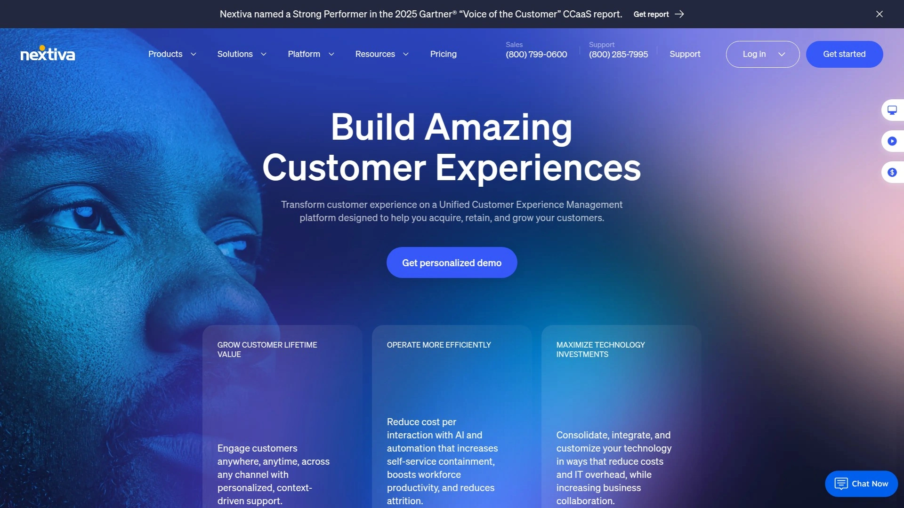

# Top 18 Cloud Telephony & Virtual Phone Systems Ranked in 2025 (Latest Compilation)

Running a modern business without reliable phone systems is like trying to sail without a compass. You're drifting. Your customers can't reach you when they need answers. Your sales team wastes hours on manual dialing and voicemail busywork. Remote workers struggle to stay connected.

Cloud telephony solves these headaches by moving your entire phone infrastructure to the internet. No bulky equipment. No expensive maintenance. Just crystal-clear calls, smart routing, and powerful features accessible from any device, anywhere. Whether you're handling support tickets or closing deals across time zones, the right virtual phone system transforms how your team communicates with customers and each other.

Below, you'll find platforms that actually work for growing businesses, ranked by their real-world value for sales teams, support centers, and distributed workforces.

***

## **[KrispCall](https://krispcall.com)**

AI-powered cloud telephony that brings advanced calling straight into your CRM.

KrispCall is built for businesses that need more than basic calling. The platform delivers local and toll-free numbers from over 100 countries, so you can establish a local presence anywhere your customers are located. What sets it apart is the unified callbox feature that consolidates all your communications inside existing CRM platforms like HubSpot, Salesforce, and Pipedrive.

The system includes phone tree IVR for intelligent call routing, call monitoring for quality assurance, and call queuing to prevent missed opportunities during high-volume periods. Teams gain productivity boosts up to 34% through AI Copilot features that summarize calls, transcribe conversations, and automate follow-up responses. This matters especially for sales teams working complex deals and support teams managing multiple channels.

Setup takes minutes rather than days. You pick your numbers, integrate with your tools, and start making calls. The platform handles both inbound customer service and outbound sales scenarios equally well. Remote teams benefit from call notes that improve handoffs and reduce confusion when multiple people interact with the same customer.

Companies using KrispCall report faster response times and smoother collaboration across distributed teams. The AI features work in the background, freeing agents to focus on actual conversations rather than administrative tasks.

---

## **[RingCentral RingEX](https://www.ringcentral.com)**

Comprehensive unified communications platform with extensive third-party integrations.

RingCentral delivers an all-in-one hub combining phone, video, SMS, and fax in a single interface. The platform stands out for its massive integration library, connecting with over 400 business applications including Salesforce, Zendesk, and Microsoft 365. This deep integration ecosystem makes it particularly valuable for organizations running complex tech stacks.

The Advanced plan unlocks automatic call screening and voicemail transcription. Call management features include call whisper and call recording, allowing managers to monitor performance and provide coaching without interrupting live conversations. Teams get reliable 99.999% uptime backed by globally distributed data centers.

Mobile and desktop apps deliver consistent experiences across devices, so your business number follows you wherever work happens. The system scales from small teams to large enterprises, though the extensive feature set can feel overwhelming initially. Pricing starts higher than some competitors, but the breadth of capabilities justifies the investment for organizations needing enterprise-grade reliability.

RingCentral suits mid to large businesses wanting unified communications with proven reliability and strong third-party connectivity.

***

## **[Dialpad](https://www.dialpad.com)**

AI-powered business communications with real-time transcription and sentiment analysis.

Dialpad brings artificial intelligence directly into every call through real-time transcriptions and sentiment analysis. The platform captures conversation details automatically, eliminating the need for manual note-taking during customer interactions. Sales teams particularly benefit from AI-powered insights that help tailor pitches and handle objections more effectively.

The system provides unlimited calling in the US and Canada, plus unlimited call recordings at even the entry-level Connect plan starting at $15 per user monthly. Visual voicemail, custom greetings, and after-hours call routing come standard. Integration with platforms like Salesforce and HubSpot happens seamlessly.

Virtual phone numbers include local area codes for wherever team members work, improving answer rates by showing familiar numbers to prospects. The modern interface feels intuitive compared to legacy systems, and the mobile app maintains full functionality for remote workers.

Dialpad fits customer service teams wanting AI assistance for faster issue resolution and sales organizations needing conversation intelligence to close more deals. The AI features may exceed needs for businesses only requiring basic calling.

***

## **[Zoom Phone](https://www.zoom.com)**

Enterprise calling integrated seamlessly with Zoom's meeting platform.

Zoom Phone makes sense for organizations already using Zoom Meetings, as the calling experience flows naturally within the familiar Zoom interface. The platform unifies phone, video, and team chat in a single app that employees already know how to navigate.

Regional Unlimited plans start at $10 per user monthly, providing solid value. The system includes call routing, call recording, IVR, call analytics, and call queues across all plans. Voice quality stands above average due to Zoom's use of the Opus codec. Team chat supports file sharing and emoji reactions for quick collaboration.

The desktop and mobile apps translate seamlessly across devices, making it simple to manage chats and call logs whether working from office or home. Integration with Zoom Meetings means you can escalate a phone call to a video conference with a single click.

Zoom Phone works best for teams already invested in the Zoom ecosystem who want straightforward calling features without the complexity of feature-heavy alternatives. It offers fewer advanced call routing options than specialized providers but delivers excellent ease of use.

***

## **[Nextiva](https://www.nextiva.com)**

Unified communications with strong customer experience management tools.

Nextiva combines business phone, video conferencing, team chat, SMS, and customer management into one intuitive platform. The Core plan starts at $15 per user monthly and includes unlimited inbound and outbound calling, business SMS, video conferencing, and team channels. This makes it accessible for small businesses transitioning from traditional landlines.

The Engage plan adds toll-free numbers, advanced reporting, and speech analytics for $25 monthly per user. The Power Suite CX at $75 monthly brings omnichannel engagement, process automation, and AI-powered transcription for contact center operations.

Customer support receives high ratings, and the onboarding process feels straightforward compared to more complex systems. The interface appears slightly dated versus newer competitors like Dialpad, but functionality remains solid. Nextiva unifies customer interactions across channels, reducing information silos between sales and support teams.

Small to midsize businesses appreciate Nextiva's balance between powerful features and manageable complexity. The platform suits organizations prioritizing customer experience while needing reliable VoIP fundamentals.

***

## **[8x8 Work](https://www.8x8.com)**

Global calling solution with unlimited domestic calling in 48 countries.

8x8 Work delivers true international flexibility by supporting unlimited domestic calling in 48 countries, not just North America. The X Series plans start at $24 monthly per user and include enterprise-grade cloud PBX with auto-attendant, voicemail, flexible call flows, and global coverage.

The platform combines phone, video, chat, and fax in one collaboration hub accessible across desktop, web, and mobile devices. Built-in team messaging enables quick responses without switching apps. Integration with over 55 applications including Microsoft Teams, HubSpot, Google Workspace, and Zendesk streamlines workflows.

Analytics dashboards provide comprehensive performance insights and usage reporting. The Frontdesk feature optimizes receptionist efficiency for high call volumes. Conversation IQ uses conversational AI to uncover insights and enable proactive coaching.

8x8 suits small to midsize businesses seeking cost-effective global calling with simple deployment. The lower-tier plans offer limited customization and basic analytics, but higher tiers unlock more robust features. Organizations with international operations particularly benefit from the extensive country coverage.

***

## **[GoTo Connect](https://www.goto.com/connect)**

Flexible unified communications with strong multiline management.

GoTo Connect unifies voice, video, messaging, and meetings in a cloud platform designed for distributed teams. The system delivers crystal-clear call quality through VoIP technology while saving thousands compared to landline infrastructure. Unlimited business phone numbers, extensions, toll-free numbers, and vanity numbers come included.

Virtual receptionist capabilities and virtual voicemail streamline incoming call management. Customizable auto-attendants, call forwarding, call routing, and call queuing handle traffic efficiently. Real-time analytics and call monitoring provide visibility into team performance.

The system supports over 180 desk phones and offers desktop apps for Mac and Windows, mobile apps for Android and iOS, plus web browser access. Hot desking comes standard on the base plan, a feature competitors often reserve for premium tiers. Presence syncing and calendar integration help remote workers manage availability automatically.

GoTo Connect works well for small to mid-sized businesses needing strong administrative controls without steep learning curves. The video and audio quality impressed during testing, and one-click conferences require no downloads. The platform balances simplicity with functionality for teams spread across multiple locations.

***

## **[Vonage Business Communications](https://www.vonage.com)**

Scalable cloud communications with 99.999% reliability.

Vonage Business Communications provides unified communications combining voice, messaging, meetings, and video on a single platform. The solution offers crystal-clear voice quality and 99.999% reliability hosted from redundant global data centers. Plans accommodate businesses from small teams to large enterprises seeking scalable solutions.

The desktop and mobile apps unify calling, messaging, conferencing, and business integrations into one interface. SMS and multimedia messages send directly from the business number using the desktop or mobile app. Vonage Meetings accommodates up to 200 attendees with scheduling integrated into Outlook and Google calendars.

Contact Center capabilities can augment the base platform with AI-powered omnichannel experiences routing customer communications to CRM systems. Chat functionality combines AI-driven bots with human support for efficient service. Conversation Analyzer tracks call quality and provides coaching insights.

Vonage SmartWAN SD-WAN solution prioritizes voice and data traffic to maintain quality of service for distributed workforces. The platform recognizes over 2,000 application routes for intelligent traffic management.

Vonage suits growing businesses needing flexible scaling with reliable call quality. Integration with leading CRMs like Salesforce enhances the value proposition. Contracts can feel rigid, and add-ons increase costs beyond base pricing.

***

## **[Aircall](https://aircall.io)**

Cloud-based business phone optimized for sales and support teams.

Aircall delivers a 100% cloud-based phone system requiring zero hardware. Setup completes in hours, with international numbers available in over 100 countries even when teams work continents away. The platform integrates seamlessly with major CRM and Helpdesk tools, automatically syncing call details to eliminate switching between systems.

Toll-free numbers, local numbers, and international numbers activate instantly. Interactive Voice Response (IVR) creates smart directories guiding callers to the correct team automatically. Call conferencing supports up to five participants. Warm transfer allows teammates to speak before transferring live calls.

Visibility dashboards show who's on calls and who's available in real-time. Analytics spot missed calls, monitor hold times, and track historical trends to boost individual and team performance. Shared contacts keep everyone following the conversation. Call recordings enable quality review and training opportunities.

The single interface centralizes control and provides detailed call analytics, transforming basic phone systems into fully operational call centers. Mobile and desktop apps maintain consistency across devices.

Aircall fits businesses with 10 to 500 employees seeking a straightforward phone system that integrates deeply with existing sales and support tools. The seven-day free trial lets teams test functionality before committing.

***

## **[Ooma Office](https://www.ooma.com)**

Budget-friendly phone system for small teams and entrepreneurs.

Ooma Office provides plug-and-play setup for non-technical users. Plans start at $19.95 per user monthly, making it one of the most affordable enterprise-grade solutions. The Essentials plan includes over 50 business features, while Ooma Office Pro adds videoconferencing and enhanced call blocking.

Virtual receptionist capabilities come standard, greeting callers professionally even on the most basic plan. Users can port existing phone numbers or choose new local or toll-free numbers. The mobile app extends your business line to any device, so calls reach you wherever you work.

Multi-device support means the business number rings on desk phones, computers, and mobile devices simultaneously. Visual voicemail, call forwarding, voicemail-to-email, and conference calling handle core business needs. Integration options remain more limited compared to enterprise platforms, and the feature set feels basic for growing teams with complex requirements.

Ooma Office suits solo entrepreneurs, tiny remote teams, and new businesses wanting professional phone capabilities without major investment. The straightforward interface works for anyone comfortable using a smartphone. Companies with 1-10 employees find the pricing and simplicity attractive.

***

## **[Five9](https://www.five9.com)**

AI-powered cloud contact center for enterprise customer experience.

Five9 specializes in contact center operations rather than general business calling. The Intelligent CX Platform combines enterprise scale with AI-driven automation to optimize customer service processes. Over 1,800 companies including IBM and Trivago rely on Five9 for cloud contact center capabilities.

The platform delivers 99.999% uptime with scalable infrastructure supporting growth without performance degradation. Open APIs and easy integration connect Five9 with existing business systems. Genius AI anticipates customer needs, empowers agents with real-time suggestions, and automates routine interactions.

Predictive dialing, comprehensive reporting, AI-powered solutions, and strong CRM integrations make Five9 powerful for contact centers. The system handles inbound, outbound, and blended omnichannel operations including voice, chat, email, SMS, and social channels.

Five9 requires dedicated implementation and has a steep learning curve. Customization options feel limited compared to more flexible platforms. The solution targets contact centers and customer service organizations needing advanced features rather than small businesses seeking basic phone systems.

Professional services teams help activate deployments in weeks. Workforce engagement management, quality monitoring, and real-time dashboards optimize agent productivity.

***

## **[Talkdesk](https://www.talkdesk.com)**

End-to-end cloud contact center with enterprise capabilities.

Talkdesk CX Cloud provides comprehensive customer experience solutions combining enterprise scale with consumer simplicity. The platform serves over 1,800 companies across 75 countries. Native AI capabilities embed directly into the platform, while third-party AI solutions integrate seamlessly.

Self-service experiences include effective IVR call flows that escalate to live agents when needed. Virtual agent conversational flows use drag-and-drop design tools. Omnichannel engagement manages interactions across voice, chat, email, SMS, web, and social channels from one unified interface.

Customer journey analytics provide customized real-time dashboards and reporting. Searchable transcripts, sentiment analysis, and automated interaction scoring identify coaching opportunities. Real-time content recommendations guide agents based on caller needs.

The contact center software includes Interactive Voice Response (IVR), Automatic Call Distribution (ACD), call forwarding, automated workflows, and real-time call monitoring. Integration with leading CX systems like Salesforce, Slack, Zendesk, and ServiceNow happens quickly through built-in connectors.

Talkdesk suits enterprises needing robust contact center capabilities with high reliability. The 100% uptime SLA and enterprise-grade security meet demanding requirements. Implementation requires planning and resources, making it less suitable for very small teams.

***

## **[CloudTalk](https://www.cloudtalk.io)**

Smart cloud phone system for sales and support teams.

CloudTalk focuses on helping growing teams have more and better calls. The multi-carrier-backed system delivers crystal-clear audio quality even during busiest days. Setup takes minutes without IT teams or complex configurations.

International numbers from over 160 countries establish local presence and boost answer rates by 40%. Smart call routing and auto-dialers connect customers and revenue teams faster. Integration with CRM and helpdesk platforms like Salesforce, HubSpot, and Pipedrive syncs call data automatically.

Over 100 features and AI tools manage every call with speed and accuracy. Power dialers, IVR, call analytics, call recording, and emotion rating optimize interactions. Real-time analytics track call activity, service levels, and customer sentiment for data-driven decisions.

Companies using CloudTalk report 81.7% increases in call volume, doubled outbound success rates, and 80% decreases in wait times. The platform scales effortlessly as teams grow, adding new numbers and users in minutes.

CloudTalk suits small to mid-sized businesses with sales and support teams wanting reliable calling backed by automation and AI insights. The five-minute response time for customer support ensures teams never wait long for help. Pricing starts at $34 monthly per user.

***

## **[JustCall](https://justcall.io)**

AI-powered communication platform with 24/7 automation.

JustCall extends beyond basic calling with multi-channel communication including voice, SMS, email, and WhatsApp. The platform serves sales pipeline growth and customer support with AI agents handling inquiries around the clock. Virtual phone numbers activate in over 58 countries.

The cloud-based system requires no new hardware or SIM cards. Users make and receive calls from computers, browsers, or desktop apps. Setup completes in 30 seconds, and concurrent calls enable instant call center creation using team member devices.

Call recordings, ratings, and notes track activity automatically. Custom IVR setup uses easy drag-and-drop tools. Built-in calendar and Google Calendar integration schedule calls efficiently. CRM integrations with platforms like Salesforce, HubSpot, and Zoho maintain synchronized contact data.

AI voice agents answer every call, respond to inquiries, schedule meetings, and route calls to human experts when needed. This 24/7 availability captures opportunities that would otherwise slip through after-hours.

JustCall fits businesses wanting comprehensive communication automation with strong international calling support. Contact rates improve 40%, average handle time drops 30%, and first call resolution speeds up 18% for users. Plans start at $30 monthly and include unlimited users.

***

## **[Avaya Cloud Office](https://www.avaya.com/en/products/cloud-office/)**

Enterprise-grade cloud communications with AI capabilities.

Avaya Cloud Office redefines business communications through AI-powered features across calling, messaging, and meetings. The platform delivers 99.999% availability with enterprise-grade security certifications including HITRUST, SOC2, and SOC3.

Streamlined communication combines calls, messaging, and meetings in one interface. AI Assistant transcribes voice calls and extracts key action items automatically. Meeting summaries, highlights, and transcripts eliminate manual note-taking. AI polishes written messages, summarizes threads, and translates into six languages.

Avaya J100 Series IP Phones and Conference Phone B199 integrate seamlessly. Desktop and mobile apps provide full access to communications from any device. Over 300 integrations including Salesforce, Office 365, and G Suite connect existing workflows.

The platform suits Avaya customers seeking cloud migration with minimal business disruption. Familiar Avaya telephony features ease the transition while delivering modern cloud capabilities. Automatic updates keep the system current without manual intervention.

Avaya Cloud Office provides enterprise organizations reliable, secure communications with AI enhancements for improved productivity. The Microsoft Teams integration embeds Avaya's telephony directly into Teams without additional licensing.

***

## **[Webex Calling](https://www.cisco.com/c/en/us/solutions/collaboration/webex-calling/index.html)**

Cisco's enterprise-grade cloud calling with complete collaboration.

Webex Calling delivers comprehensive enterprise calling with team collaboration in one solution. The platform integrates calling plans with the Webex collaboration suite or connects through partner carriers. Centralized administration, enterprise-grade security, and carrier-grade reliability provide trust for mission-critical communications.

Virtual receptionist, personalized voice mailboxes, extension numbers, direct inward dialing, and directory-based dialing handle call management professionally. Synchronized directory and dial plans support mixed cloud and on-premises networks for flexible migration.

Desktop and mobile devices maintain consistent experiences so teams stay productive from any location. The Control Hub interface simplifies provisioning and management for IT while self-care portals let users handle basic settings. Teams-certified devices include over 150 desk phones, headsets, and speakerphones.

Webex combines calling, meetings, messaging, and collaboration into one easy-to-use solution. AI-powered features enhance the business phone system for modern workflows. The platform supports hybrid work with anytime, anywhere communications across devices.

Webex Calling suits enterprises seeking complete unified communications with proven Cisco reliability. The Call Plan starting at $17 monthly per user provides cloud-based phone numbers and full calling features. Integration with Webex Meetings delivers the most complete collaboration experience.

***

## **[Mitel](https://www.mitel.com)**

Hybrid cloud communications trusted by enterprises globally.

Mitel powers over 2 billion connections daily serving as the number one UC provider worldwide. The company holds over 2,100 patents and serves 70+ million users globally. Mitel specializes in hybrid solutions combining best-in-class collaboration with enterprise-grade telephony.

MiCloud Connect delivers complete business communications combining voice, video, collaboration, and contact center capabilities. The solution runs on Google Cloud for proven reliability. Mobile-first design supports work from any location. Integrations with leading CRMs and calendars streamline workflows.

Hybrid cloud approach lets enterprises modernize at their own pace while maintaining operational continuity. The platform supports secure, scalable deployments with AI-powered enhancements. Critical communications capabilities meet needs of demanding industries including public sector and healthcare.

Flexible service plans ensure organizations never overpay for unused features while enabling easy upgrades as needs change. Implementation and ongoing support come from dedicated teams understanding enterprise requirements.

Mitel suits large enterprises and government entities with complex environments needing proven communications infrastructure. The 50+ years supporting mission-critical communications demonstrate reliability for organizations that can't afford communication failures.

***

## **[CallHippo](https://callhippo.com)**

AI-driven virtual phone system with three-minute setup.

CallHippo combines virtual phone systems with AI voice agents for comprehensive communication automation. The platform offers local and toll-free numbers for over 50 countries with three-minute setup. VoIP-based system requires only internet connection, computer or mobile device, and headset.

Time-zone aware calling optimizes outreach timing. Smart call forwarding, call conferencing, call barging, call queuing, on-hold music, and voicemail handle core phone system needs. Power dialer, smart switch, and real-time reporting boost productivity.

AI voice agents manage inbound queries, outbound calls, and lead qualification continuously. Gen AI-powered assistants answer routine inquiries and respond to customer requests in multiple languages around the clock. This 24/7 availability generates leads and takes appointments even when human teams are off.

Integration with over 85 products including CRM and helpdesk platforms syncs data automatically. Call transcription and voicemail transcription convert communications to text for easier tracking. Conversation intelligence triggers automation based on client inquiries.

CallHippo serves businesses from startups to enterprises seeking affordable, feature-rich virtual phone systems. Teams report 99.5% uptime with zero jitter and latency. Over 70 million calls served across 5,000+ happy customers validate reliability. The free Basic plan lets small businesses evaluate capabilities before upgrading.

***

## **[Microsoft Teams Phone](https://www.microsoft.com/en-us/microsoft-teams/microsoft-teams-phone)**

Enterprise calling integrated directly into Microsoft Teams.

Microsoft Teams Phone transforms Teams into a complete business phone system. The cloud-based service combines calls, chats, and meetings in one familiar app employees already use. Teams Phone with Calling Plan provides all-in-cloud voice with Microsoft acting as PSTN carrier.

Core and advanced calling features include call forwarding, voicemail, delegation, and group call pickup. One business-provided phone number works across computers, mobile devices, and desk phones. Over 150 Teams-certified devices from nine partners fit any budget and work style.

Setup completes in minutes through Teams Admin Center by establishing operator connection, provisioning users, and assigning phone numbers. Management scales effortlessly as organizations grow. Number porting transfers existing numbers from current providers.

Native integration with Microsoft 365 and Office 365 eliminates switching between applications. Calls seamlessly integrate into work flow with consultative transfers, shared line appearance, and collaborative features. Extensions, phone menus, call routing, and analytics come standard.

Microsoft Teams Phone suits organizations already using Microsoft 365 wanting to replace legacy PBX systems with modern cloud calling. Plans start at $8 monthly per user for phone system only, or $15 monthly including domestic calling plans. Enterprises benefit from simplified deployment, unified licensing, and streamlined management through familiar Microsoft tools.

***

## Frequently Asked Questions

**How quickly can I set up a cloud phone system for my business?**

Most modern cloud phone systems activate within minutes to hours, not days. Services like CallHippo and CloudTalk specifically advertise three to five-minute setup times. You typically choose your phone numbers, download apps to your devices, and start making calls immediately. No special equipment arrives by mail, and no technicians visit your office for installation.

**Can I keep my existing business phone number when switching providers?**

Yes, virtually all major providers support number porting, allowing you to transfer existing phone numbers to their systems. The process usually takes a few business days to complete and involves submitting your current account information to the new provider. Microsoft Teams Phone, RingCentral, and other platforms handle this automatically so customers and clients never notice the change.

**What's the difference between a cloud phone system and traditional PBX?**

Traditional PBX requires physical hardware installed at your office location, creating dependency on that specific place and requiring expensive maintenance. Cloud phone systems run entirely over the internet, eliminating hardware costs while enabling your team to work from anywhere with internet access. Cloud systems also update automatically, integrate with modern software tools, and scale simply by adding user licenses rather than installing new equipment.

---

## Conclusion

The right cloud phone system stops being a technology decision and becomes a business advantage. Teams close deals faster when AI handles the grunt work of dialing and note-taking. Support teams resolve issues quicker when customer context loads automatically. Remote workers stay connected seamlessly when business numbers follow them across devices.

**[KrispCall](https://krispcall.com)** stands out for businesses needing intelligent calling that actually works inside existing CRM platforms. The unified callbox eliminates toggling between systems while AI Copilot frees agents from administrative busywork. For teams managing complex customer relationships across sales and support channels, KrispCall delivers the integration depth and automation that keeps everyone moving forward together.
